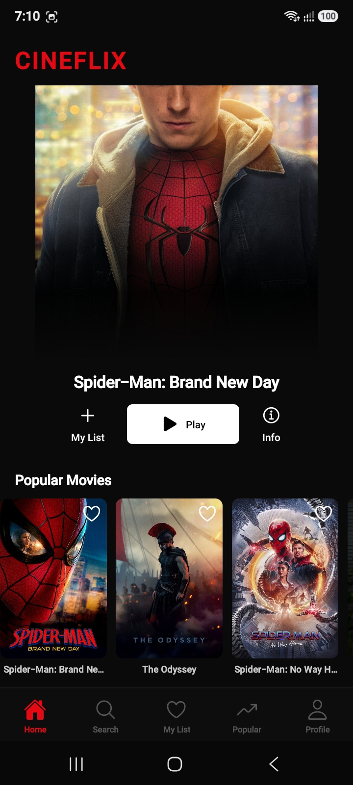
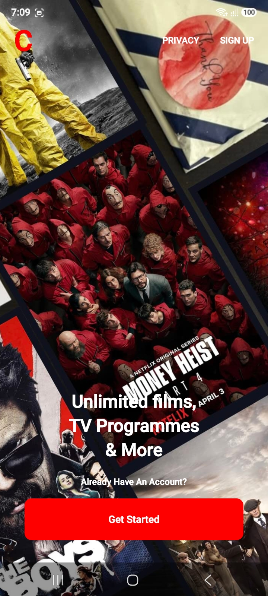
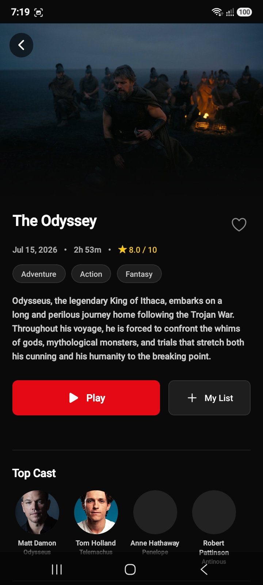
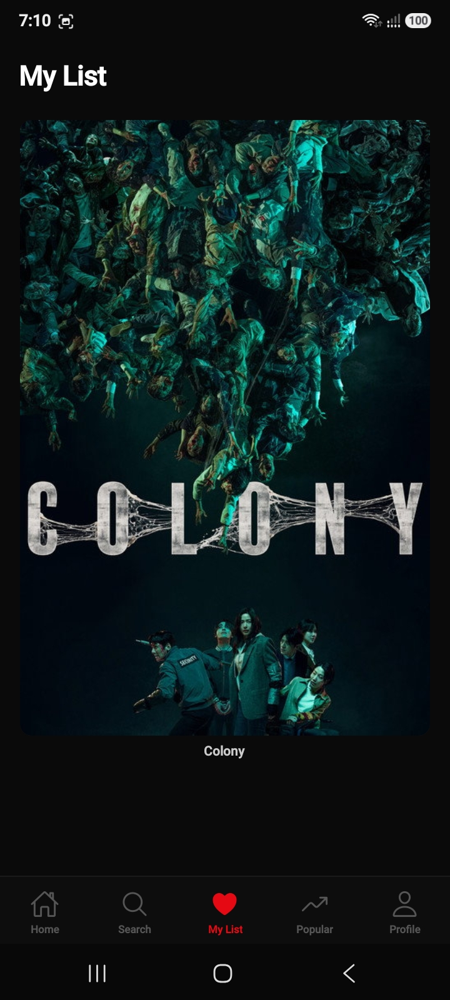
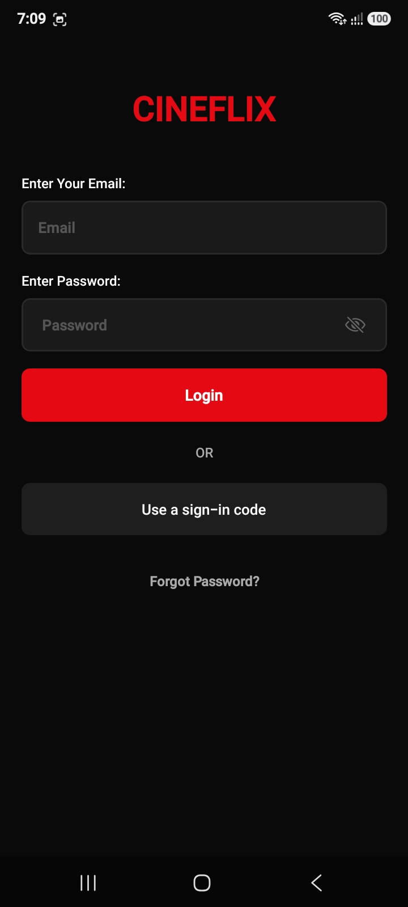

<h1 align="center">🎬 Cineflix</h1>

<h3 align="center">A modern React Native movie application inspired by Netflix, with real authentication, live movie data, search, favourites, viewing history, movie details, and a custom video player.</h3>

  

<i>Debug build — enable "Install from unknown sources" on Android if required.</i>

  
  
  
  

<h3 align="center">📸 Screenshots</h3>

  
  
  
  
  
  
  

<i>Movie browsing, search, details, favourites, profile, history, and authentication screens.</i>

<h2>About the Project</h2>

Cineflix is a React Native movie application inspired by modern streaming platforms such as Netflix. The project was built as part of my Mobile Application Development coursework, with a focus on creating a complete mobile experience rather than only designing individual screens.

The application connects to the TMDB API to retrieve movie information and uses Firebase Authentication for account management. Redux Toolkit and Redux Persist are used to manage locally stored favourites and viewing history, while React Native Video provides the video playback experience.

The project also focuses on reusable components, structured navigation, centralized configuration, and separating screens and application logic into clear feature areas.

<h2>Features</h2>

<ul>
  <li><strong>Authentication</strong> — Firebase email/password registration, login, password reset, and persisted authentication sessions.</li>
  <li><strong>Movie Browsing</strong> — Browse Popular, Upcoming, and Top Rated movies using live data from the TMDB API.</li>
  <li><strong>Search</strong> — Search for movies and display results dynamically with loading, empty, and error states.</li>
  <li><strong>Movie Details</strong> — View movie information including overview, genres, cast, and similar titles.</li>
  <li><strong>Favourites</strong> — Save movies to a personal favourites list and access them later.</li>
  <li><strong>Viewing History</strong> — Keep track of recently viewed movies locally on the device.</li>
  <li><strong>Video Player</strong> — Watch the available demo video through a custom player with play/pause, seeking, and auto-hiding controls.</li>
  <li><strong>Profile</strong> — View account information, saved movies, and recently viewed content in one place.</li>
  <li><strong>Splash Screen</strong> — Application launch screen before entering the main navigation flow.</li>
</ul>

<h2>Tech Stack</h2>

The project is built with the following technologies and libraries:

<ul>
  <li>React Native</li>
  <li>TypeScript</li>
  <li>React Navigation</li>
  <li>Redux Toolkit</li>
  <li>Redux Persist</li>
  <li>AsyncStorage</li>
  <li>Firebase Authentication</li>
  <li>TMDB API</li>
  <li>React Native Video</li>
  <li>Axios / API-based data fetching</li>
</ul>

<h2>Architecture</h2>

Cineflix follows a feature-oriented React Native structure. Navigation is separated from individual screens, reusable UI elements are kept in shared components, API and application configuration are centralized, and Redux handles state that needs to persist between screens and application launches.

<ul>
  <li><strong>App Shell</strong> — Initializes the application and provides the required navigation and state-management providers.</li>
  <li><strong>Navigation</strong> — Handles authentication, the main application flow, movie details, favourites, profile, and video playback screens.</li>
  <li><strong>Feature Screens</strong> — Movie browsing, search, movie details, favourites, profile, authentication, video playback, and splash screen.</li>
  <li><strong>Shared Components</strong> — Reusable UI elements such as password fields and application modals.</li>
  <li><strong>Redux</strong> — Manages favourites and viewing history.</li>
  <li><strong>Redux Persist</strong> — Keeps selected application state available after restarting the application.</li>
  <li><strong>Remote Data</strong> — TMDB provides movie information, images, categories, cast information, and related titles.</li>
</ul>

<h2>Navigation</h2>

The application uses a root navigation structure that separates authentication from the main movie experience.

<h3>Authentication</h3>

<ul>
  <li>Login</li>
  <li>Sign Up</li>
  <li>Password Reset</li>
</ul>

<h3>Main Application</h3>

<ul>
  <li>Home</li>
  <li>Popular Movies</li>
  <li>Search</li>
  <li>Favorites</li>
  <li>Profile</li>
  <li>Movie Details</li>
  <li>Video Player</li>
  <li>Viewing History</li>
</ul>

<h2>Project Structure</h2>

<pre>
src/
  components/
    Reusable UI components and modals

  constants/
    API configuration
    Theme configuration
    Video configuration

  navigation/
    Root stack
    Bottom tab navigation

  redux/
    Store
    Favourites slice
    History slice

  screens/
    Auth/
      Login
      Signup

    Home/
      Popular movies
      Upcoming movies
      Top rated movies

    Search/
      Movie search

    MovieDetail/
      Movie information
      Cast
      Similar titles

    Favorites/
      Saved movies

    Popular/
      Popular movies

    Profile/
      Account
      Favourites
      History

    VideoPlayer/
      Video playback
      Custom controls

    Splash/
      Application launch screen
</pre>

<h2>Authentication</h2>

Firebase Authentication is used for the account system. Users can create an account, sign in, request a password reset, and return to the application with their authenticated session.

<ul>
  <li>Email/password registration</li>
  <li>Email/password login</li>
  <li>Password reset</li>
  <li>Persisted authentication session</li>
  <li>Authentication error handling</li>
  <li>Logout</li>
</ul>

The authentication flow is separated from the main movie experience so users are directed to the appropriate part of the application based on their session.

<h2>Home and Movie Browsing</h2>

The home experience is built around discovering movies from several TMDB categories. Users can browse popular, upcoming, and top-rated titles and select a movie to view its full details.

<ul>
  <li>Popular movies</li>
  <li>Upcoming movies</li>
  <li>Top-rated movies</li>
  <li>Movie posters and artwork from TMDB</li>
  <li>Navigation to detailed movie information</li>
  <li>Access to favourites and other movie sections</li>
</ul>

<h2>Search</h2>

The search screen allows users to look up movies directly through the TMDB API.

<ul>
  <li>Movie search</li>
  <li>Dynamic search results</li>
  <li>Loading states</li>
  <li>Empty result handling</li>
  <li>Error handling</li>
  <li>Navigation from search results to movie details</li>
</ul>

<h2>Movie Details</h2>

The movie detail screen provides a more complete view of a selected title rather than only displaying its poster.

<ul>
  <li>Movie title</li>
  <li>Overview</li>
  <li>Genres</li>
  <li>Cast information</li>
  <li>Similar movie recommendations</li>
  <li>Favourite functionality</li>
  <li>Video playback access</li>
</ul>

This screen is intended to bring together the information a user would normally need before deciding whether to watch or save a movie.

<h2>Favourites</h2>

Users can save movies they are interested in and access them from the dedicated favourites section.

Favourite state is managed through Redux Toolkit and persisted locally using Redux Persist, so saved movies remain available after restarting the application.

<h2>Viewing History</h2>

Cineflix keeps track of recently viewed movie content and makes that information available through the user's profile.

History is stored locally on the device rather than being synchronized with a remote database. This keeps the implementation simple while still providing a useful user experience.

<h2>Video Player</h2>

The application includes a custom video player built with React Native Video. The player is designed to provide a simple streaming-style viewing experience within the application.

<ul>
  <li>Play and pause controls</li>
  <li>Video seeking</li>
  <li>Auto-hiding playback controls</li>
  <li>Custom player interface</li>
  <li>Dedicated video player screen</li>
</ul>

The current implementation uses a shared demo video rather than real movie streams. This is intentional for a portfolio and educational project because distributing or streaming copyrighted movie content would require appropriate licensing.

<h2>Profile</h2>

The profile screen brings together account information and the user's locally stored movie activity.

<ul>
  <li>Account information</li>
  <li>Favourite movies</li>
  <li>Recently viewed movies</li>
  <li>History access</li>
  <li>Navigation to other profile-related sections</li>
</ul>

<h2>State Management</h2>

Redux Toolkit is used for application state that needs to be shared across screens and persisted between application launches.

<ul>
  <li><strong>Favourites Slice</strong> — Stores movies saved by the user.</li>
  <li><strong>History Slice</strong> — Stores recently viewed movie information.</li>
  <li><strong>Redux Persist</strong> — Persists selected Redux state using local device storage.</li>
</ul>

This approach allows favourites and viewing history to remain available without requiring a separate database for those features.

<h2>Reusable Components</h2>

<h3>Password Field</h3>

A reusable authentication input component used for password-related fields. It helps keep the login and registration screens consistent and makes password input behavior easier to maintain.

<h3>App Modals</h3>

Reusable modal components are used for displaying application feedback and keeping common interaction patterns consistent across different screens.

<h2>Data Flow</h2>

<pre>
Firebase Authentication
          |
          v
    Login / Sign Up
          |
          v
    Main Application
          |
    +-----+------+--------+
    |            |        |
    v            v        v
  Browse       Search   Profile
    |            |        |
    +------------+--------+
                 |
                 v
              TMDB API
                 |
                 v
          Movie Information
          /      |       \
         v       v        v
      Details  Similar   Search

Favourites -----> Redux -----> Redux Persist
History ---------> Redux -----> Redux Persist

Movie Details -----> Video Player
                         |
                         v
                  Demo Video Source
</pre>

<h2>Setup</h2>

<h3>Prerequisites</h3>

Before running Cineflix locally, make sure the following are installed and configured:

<ul>
  <li>Node.js</li>
  <li>React Native development environment</li>
  <li>Android Studio and Android SDK for Android development</li>
  <li>JDK compatible with the React Native version used by the project</li>
  <li>Xcode and CocoaPods if building for iOS</li>
  <li>A Firebase project</li>
  <li>A TMDB account and API access</li>
</ul>

<h3>Installation</h3>

<pre>
git clone https://github.com/Ali-Razaaaaa/Cineflix.git
cd Cineflix
npm install
</pre>

<h3>Android</h3>

Start an Android emulator or connect a physical Android device and run:

<pre>
npx react-native run-android
</pre>

To generate a release APK on Windows:

<pre>
cd android
.\gradlew.bat assembleRelease
</pre>

The generated APK will normally be available at:

<pre>
android/app/build/outputs/apk/release/app-release.apk
</pre>

<h3>iOS</h3>

For iOS development, install the CocoaPods dependencies before opening the project in Xcode:

<pre>
cd ios
pod install
cd ..
</pre>

Then open the iOS project through Xcode or run the application using the React Native CLI.

<h2>Environment Variables and Configuration</h2>

Cineflix relies on external services for authentication and movie information. These services need to be configured before running the application.

<h3>TMDB</h3>

The TMDB API configuration is centralized in the project's constants/configuration area. The API is used to retrieve movie information, categories, search results, cast information, images, and similar titles.

For a production application, API credentials should ideally be protected behind a backend service rather than shipping sensitive credentials directly inside the mobile application.

<h3>Firebase</h3>

Firebase Authentication needs to be configured for the Android and/or iOS application before the authentication screens can be used.

Make sure the Firebase project configuration matches the application package and platform configuration used by the project.

<h2>Important Limitations</h2>

Cineflix is an educational and portfolio project designed to demonstrate a realistic movie application experience. Some parts of a commercial streaming platform have intentionally been simplified.

<ul>
  <li><strong>Demo video content</strong> — The video player currently uses a shared demo clip rather than real movie streams. This avoids distributing copyrighted movie content without the required licenses.</li>
  <li><strong>Local favourites</strong> — Favourite movies are stored locally on the device and are not synchronized with a cloud database.</li>
  <li><strong>Local viewing history</strong> — Viewing history is stored locally and is not shared between devices.</li>
  <li><strong>Client-side TMDB configuration</strong> — The current demo keeps TMDB configuration in the application. A production implementation should place API access behind a secure backend.</li>
  <li><strong>No subscription system</strong> — The project does not currently include payments, subscriptions, or membership tiers.</li>
  <li><strong>No real streaming catalogue</strong> — TMDB provides movie metadata and artwork, but it does not provide licensed full-length movie streams for this application.</li>
  <li><strong>Limited backend functionality</strong> — Firebase is currently used primarily for authentication rather than as a complete movie-platform backend.</li>
  <li><strong>Testing can be expanded</strong> — The repository includes the React Native testing setup, but broader unit, integration, and end-to-end coverage would be useful for a production application.</li>
</ul>

<h2>Future Improvements</h2>

There are several areas where Cineflix could be extended into a more complete streaming application.

<ul>
  <li>Move TMDB requests behind a secure backend service</li>
  <li>Add Firestore or another database for synchronized favourites and viewing history</li>
  <li>Add user profiles and account management</li>
  <li>Add real-time synchronization between devices</li>
  <li>Introduce a subscription and payment system</li>
  <li>Add push notifications for new movie releases</li>
  <li>Improve recommendation logic based on viewing activity</li>
  <li>Add offline movie metadata and caching</li>
  <li>Add stronger loading and offline states throughout the application</li>
  <li>Expand automated unit and integration testing</li>
  <li>Connect the video player to properly licensed streaming content</li>
</ul>

<h2>Project Purpose</h2>

Cineflix was built as part of my Mobile Application Development coursework and has also been developed as a portfolio project to demonstrate practical React Native development.

The main focus was to build a complete movie browsing experience that combines real authentication, external API integration, persistent application state, structured navigation, reusable components, and video playback in a single mobile application.

<h2>What I Learned</h2>

<ul>
  <li>Building multi-screen mobile applications with React Native</li>
  <li>Structuring applications with React Navigation</li>
  <li>Implementing Firebase email/password authentication</li>
  <li>Working with the TMDB REST API</li>
  <li>Managing application state with Redux Toolkit</li>
  <li>Persisting Redux state with Redux Persist and AsyncStorage</li>
  <li>Building reusable authentication and modal components</li>
  <li>Creating custom video playback controls with React Native Video</li>
  <li>Handling loading, empty, and error states when working with APIs</li>
  <li>Organizing a React Native project into maintainable feature areas</li>
  <li>Designing a mobile movie experience inspired by modern streaming applications</li>
</ul>

<h2>Contact</h2>

  

  

  

  ⭐ If you found this project interesting, feel free to explore the code and give the repository a star.

